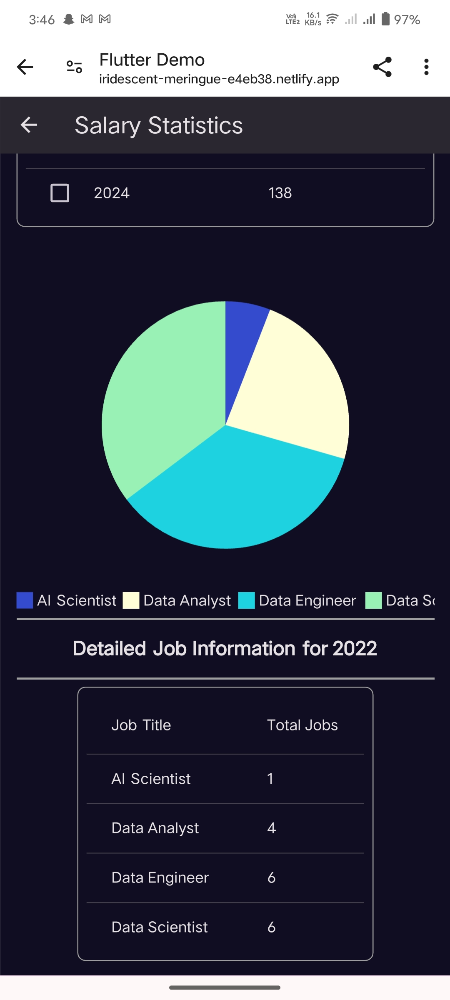

# Trend Analysis

This project is a Flutter application that provides insights into Machine Learning Engineer salaries from 2020 to 2024. The application displays data in an interactive table and provides visual analytics through graphs. Additionally, it offers a chat interface leveraging OpenAI's API to extract business insights from the data.

## Features

1. **Main Table**: Displays year-wise ML Engineer salary data, including total jobs and average salary. The table is sortable by any column.
2. **Analytics**: 
   - Line graph showing the change in the number of jobs from 2020 to 2024.
   - On clicking a row in the main table, a secondary table appears, displaying aggregated job titles and their counts for that year.
3. **Chat App with LLMs**: An interactive chat interface that provides detailed business insights based on the dataset using OpenAI's API.

## Screenshots

## Installation

### Prerequisites

- Flutter SDK
- Firebase Account
- OpenAI API Key

## Deployment

The application is deployed on Netlify. You can access it using the following link:

[ML Engineer Salaries Dashboard](https://iridescent-meringue-e4eb38.netlify.app/)

## APK Release

Download the APK for the Android release from the following link:

[Download APK](https://github.com/SanidhayaSharma141/trend_analysis/releases/tag/master)

